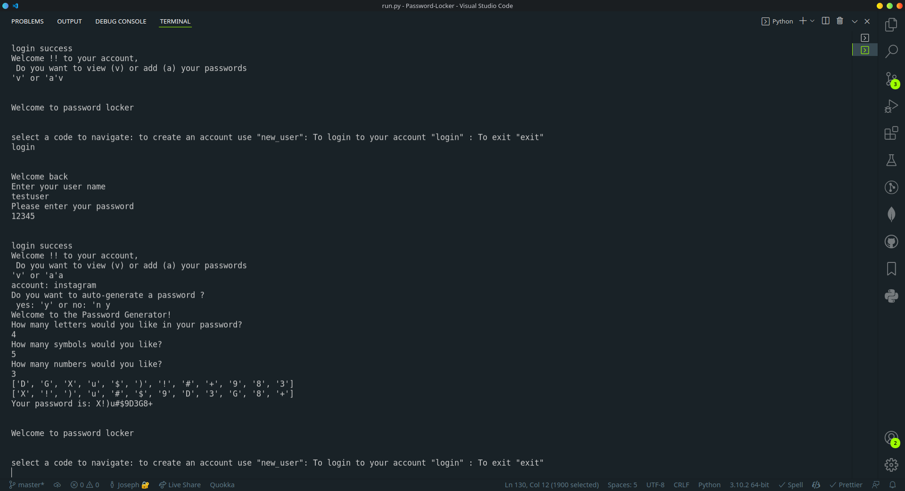

<!-- @format -->

# Password Locker

This application was developed by <a href="https://www.amanijoseph.com">Amani Joseph</a>

# Description

This is an application that allows the user to create an account then provide password or choose the auto-generate password then the user is allowed to log into his/her account when done creating the account.The user can also store password of an already existing account.The user also has an option to save multiple users and delate them as well.

# Setup requirements

- Python3
- Code-editor
- Terminal

# Setup Installation

- visit amanijoseph github and fork it from Password-Locker repo
- on the folder you want to clone on type
- git clone https://github.com/amanijoseph/Password-Locker
- user the terminal to run it by typing
- $chmod +x run.py
- $ ./run.py command

# Bugs

no known bugs

# Technology used

Python3

# License

Click this link to access the license <a href="https://choosealicense.com/licenses/mit">MIT LICENSE</a>

- Amani-Joseph &copy; 2021

# screenshot

